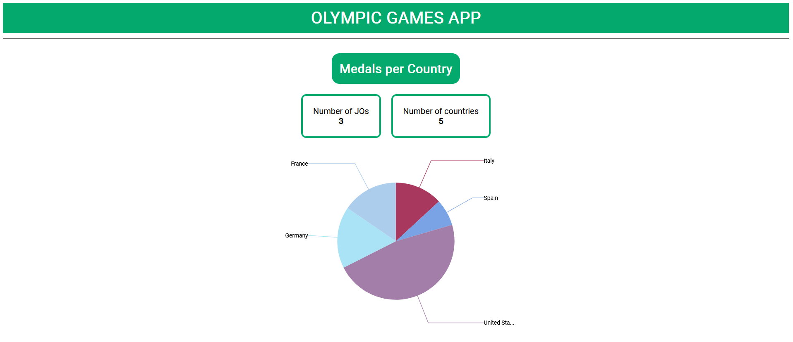
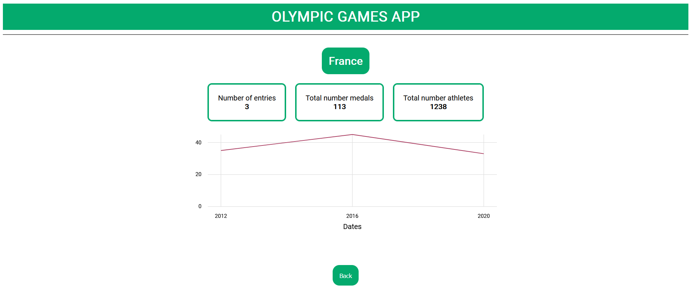

## Project 2 - Telesport

Second project of OpenClassrooms Java/Angular Fullstack Training Course.

The original source code comes from [this repository in the OpenClassrooms Student Center](https://github.com/OpenClassrooms-Student-Center/Developpez-le-front-end-en-utilisant-Angular).

This project was updated with [Angular CLI](https://github.com/angular/angular-cli) version 17.3.0 using [Node](https://docs.npmjs.com/about-npm) version 20.11.1.

## Development server

_Requirements:_
- [Git](https://git-scm.com/book/en/v2/Getting-Started-Installing-Git)
- [Node](https://docs.npmjs.com/downloading-and-installing-node-js-and-npm)

Clone the repository locally using Git by running `git clone https://github.com/JuFlajollet/project2-telesport.git` in a terminal.\
Move to the directory of your local clone and run `npm install` to install the necessary dependencies.\
Run `ng serve` to start a development server.\
Navigate to `http://localhost:4200/` to see the application running.\
The application will automatically reload if you change any of the source files.

## Build

Run `ng build` to build the project.\
The build artifacts will be stored in the `dist/` directory.

## Architecture

## How it works

### Home page

###  Detail on a country 
(_By clicking on the corresponding slice of the pie chart on home page_)\

